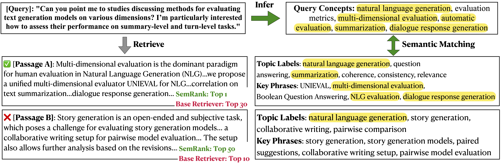

# SemRank
The source code used for paper [Scientific Paper Retrieval with LLM-Guided Semantic-Based Ranking](https://arxiv.org/abs/2505.21815), published in EMNLP 2025.

## Overview
**SemRank** is an effective and efficient paper retrieval framework that combines LLM-guided query understanding with a concept-based semantic index. Each paper is indexed using multi-granular scientific concepts, including general research topics and detailed key phrases. At query time, an LLM identifies core concepts derived from the corpus to explicitly capture the query's information need. These identified concepts enable precise semantic matching, significantly enhancing retrieval accuracy.

Please refer to our paper for more details ([paper](https://arxiv.org/abs/2505.21815)).

</img>

## Datasets
We use CSFCube, DORISMAE, and LitSearch in our experiments. We use the processed version of CSFCube and DORISMAE available [here](https://aclanthology.org/attachments/2024.emnlp-main.407.data.zip) and LitSearch from [HuggingFace](https://huggingface.co/datasets/princeton-nlp/LitSearch).

## Build Index

Run the following commands to build the semantic index.
```
# Predict candidate topic labels (GPU needed)
python eval_classifier.py

# Get LLM-assigned topic labels (OpenAI key needed)
python llm-topic.py

# Encode corpus + semantic labels (GPU needed)
python encoding.py
```
Our code by default load and process LitSearch with gpt-4.1-mini and specter2. Please check the detailed arguments for changing to different encoders or LLMs and how to load local corpus at ```eval_classifier.py```.

We provide the trained topic classifier checkpoint on the CSRanking domain using [MAPLE](https://github.com/yuzhimanhua/MAPLE). The checkpoint can be [downloaded here](https://www.dropbox.com/scl/fi/tzg189k3n6tfxr2lzvjqj/topic_classifier_specter2.pt?rlkey=hnp2kfkxezubqeblpq4ym8kkd&st=btgz2a4s&dl=0) and please put it in the ```./classifier``` folder which also includes the complete label space. 

If you want to use semantic indexing in domains other than Computer Science, we recommend you to look at other available corpora from [MAPLE](https://github.com/yuzhimanhua/MAPLE) and check the text classifier training code by [TELEClass](https://github.com/yzhan238/TELEClass) which also supports training a hierarchical text classifier without labeled data.

## Run SemRank Retrieval

Please check ```SemRank.ipynb``` which includes step-by-step running of SemRank

## Citations

If you find our work useful for your research, please cite the following paper:
```
@inproceedings{zhang2025semrank,
    title={Scientific Paper Retrieval with LLM-Guided Semantic-Based Ranking},
    author={Yunyi Zhang and Ruozhen Yang and Siqi Jiao and SeongKu Kang and Jiawei Han},
    booktitle={Findings of EMNLP},
    year={2025}
}
```